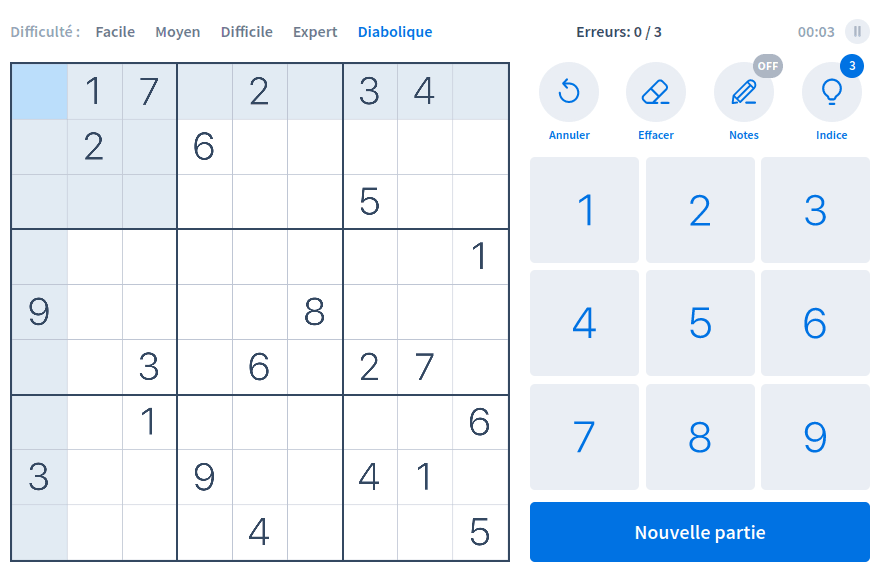

# Workshop

## Sudoku solving using image recognition

<center>
  
</center>

## Installation

Check your version of python3, If you don't have it you will need to install it, after that you can get Pip :

```bash
    python3 --version
    sudo apt-get install python3
    sudo apt-get install python3-pip
```

Now that you got pip, you can install the rest of the dependencies

```bash
    pip3 install opencv-python
    pip3 install numpy
    pip3 install selenium
    pip3 install pillow
```

## Starting

First train the model. Go in the IA folder.

```bash
cd IA/
python3 ia-train.py
```

A window will open, and numbers will be displayed. You just need to tell the AI what number is in each square.

To start the program

```bash
python3 main
```
